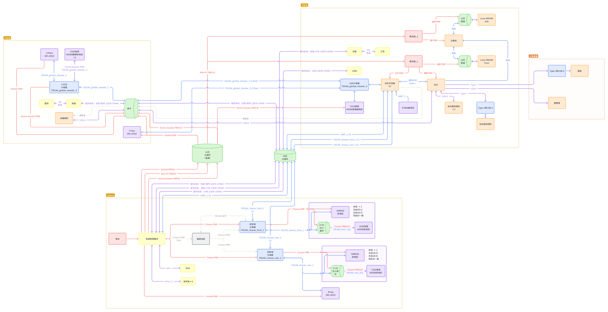

# Sentry2025

## TODO
- [ ] 2.5m/s的运动速度，停止时会飘逸，感觉是舵软了点，还得再调调
- [x] 基本上CtrlMode是没有用的，后续考虑删除
- [x] 增加向裁判系统发送信息部分
- [x] 写检录模式，这个时候关闭热量限制
- [ ] 仔细读 feed 组件和 老英雄的 refactor 分支中的 feed，解决堵转检查问题，堵转检测不能让它套圈，套圈了就有问题,fake_heat 比实际热量要低很多
- [x] 测裁判系统V1.9.0
- [x] 需要一直向裁判系统发复活信号

## 血泪教训
1. 裁判系统走小滑环特别需要注意所能承受电流大小；
2. 达妙先 烧固件+参数标定+校准+设置ID （仅需要串口线）再安装，再 标零位（需要CAN+串口）；
3. 当一个CAN上挂在多个设备的时候，过高频率将会导致严重丢包，500Hz给5个设备可用，1kHz给5个设备就会严重丢包，丢包可能导致电机反馈一些奇怪的波动（可能会表现为，能控但不完全能控）；
4. 多个设备挂在同一个CAN上，要注意尽量保证终端电阻为60Ω，如果太多设备挂载并都引入终端电阻可能会导致总电阻过小引发奇怪问题（我暂时没遇到过，这暂时是个传说）。6020、C610、C620都可以调一个拨杆来开关，H7和C板默认都带有终端电阻，单个设备的终端电阻阻值一般为120Ω；
5. 2PIN对插线比较容易损坏（断口处接触不良）建议使用XT30，3PIN可以考虑使用3相接头（3508那种），或者使用对插（还算稳定）；
6. 细线接XT30比较考验手艺，很容易断，需要多检修，剩下的就自求多福吧；
7. 编译成为release版本，一个控制周期整体代码的运行时长会大幅度降低，但是ozone很多数据就查看不到了。可以选择性的编译组件库为release版本，自己写的部分为debug版本。或者赛前统一修改为release版本，保证通信正常；
8. H7想要正常使用DMA UART需要一点小操作，具体请查看战队wiki[通用通信（Comm）驱动 - Hello World 技术知识库](https://zju-helloworld.github.io/Wiki/组件说明/嵌入式系统支持/板级支持包/通用通信驱动/#h7-变量位置配置)或者这个commit[59c44ad](https://github.com/ZJU-HelloWorld/Sentry2025/commit/59c44ad58498176ddcae7eb802ac72d30b2a9e97)。

## 电路拓扑

- 由于超电和硬触发最后并没有投入使用，所以拓扑图中超电相关用灰色或者虚线描述
- 括号内的数字表示使用滑环的线数
- 中滑环中不同裁判系统组合对应不同滑环路数主要考虑到设备的电流需求
- 电机ID设置如下：
  - kMotorIdWheelLeftFront = 2U,
  - kMotorIdWheelLeftRear = 3U,
  - kMotorIdWheelRightRear = 4U,
  - kMotorIdWheelRightFront = 1U,
  - kMotorIdRudderLeftFront = 2U,
  - kMotorIdRudderLeftRear = 3U,
  - kMotorIdRudderRightRear = 4U,
  - kMotorIdRudderRightFront = 1U,
  - kMotorIdGimbalMainYaw = 1U,
  - kMotorIdGimbalSmallPitch = 2U,
  - kMotorIdGimbalSmallYaw = 3U,
  - kMotorIdShooterFeed = 3U,
  - kMotorIdShooterFricLeft = 1U,
  - kMotorIdShooterFricRight = 2U
- 图中：红线表示电源，蓝线表示信号，紫色表示电源+信号
- 图中：红色框表示电源，橙色表示计算平台或视觉元件，黄色表示裁判系统，绿色表示滑环或辫子，蓝色表示转接件，紫色表示电机电调